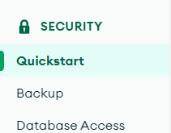
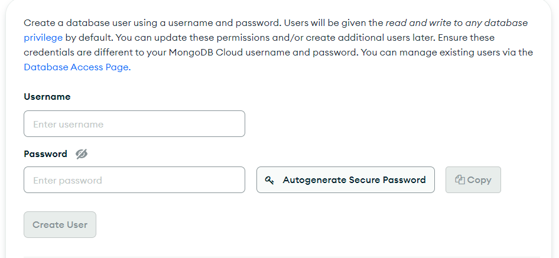

# TTDS Data collection modeule

The repository for the data collection part of the TTDS assignment. 

This repository includes 2 docker-compose files. One for testing, `docker-compose-dev.yml` and one for production `docker-compose-prod`.

Build
```
docker-compose -f docker-compose-<type>.yml build
```

and run

```
docker-compose -f docker-compose-<type>.yml up
```

## Development

Inspect the stored documents using

```
docker exec -it ttds-data-collection_mongodb_1 mongosh
```

Then from the mongo shell

```
use jobs_db
```

Connt the documents

```
db.jobs.countDocuments()
```

### Production

The production version stores the documents in a `mongodb` instance in a project I made. In order to conncet to the production db, you need a `mongo` account, preferably student account, of which I will invite in the project. When you do, message me so I can add your email to the project. When that is done, you will need to create user credentials. To do this, go in the `Security` section of the scrollbar and press `Quickstart`. Then, input your cretentials and create the user.





You will also need to provide your IP to the mongo instance so it accepts that connection. In the `Security` section, go to `Network Access` and add your IP address.

To connect your local code with mondo you need a `.env` file. Copy the file

```
cp .env.example .env
```

Replace `<username>` and `<password>` with your credentials
```
MONGO_URI=mongodb+srv://<username>:<password>@ttds-cluster.vubotvd.mongodb.net/?retryWrites=true&w=majority
```

And run the code using:
```
docker-compose -f docker-compose-prod.yml up --build
```

If you don't want to use `docker` for the production, you can just run `main.py`. Just make sure you have the dependencies installed. 

Now the scraped jobs will be sent to the `mongo` instance.

You can query the database using the [Mongo shell](https://www.mongodb.com/docs/mongodb-shell/) or [Python (pymongo)](https://www.mongodb.com/docs/drivers/pymongo/), or any other way you like.

### TODO
1. Make script that auto-deletes data that is older than a certain time, in order to not have outdated data in the db.